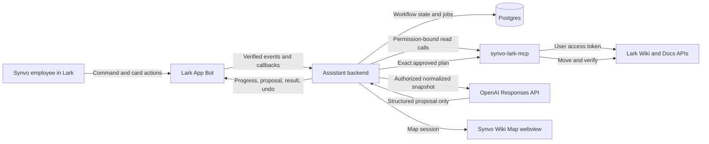

# `/organize-wiki` Implementation Plan

Status: Draft  
Last updated: 2026-08-06  
Workflow owner: TBD  
Engineering owner: TBD

## 1. Objective

Implement and close the first Synvo Lark Assistant workflow:

```text
/organize-wiki <lark-wiki-subtree-link>
```

The workflow must let an authorized Synvo Wiki administrator:

1. Scan one authorized Lark Wiki subtree.
2. Inspect an accurate, permission-safe Wiki Map.
3. Review a small set of GPT-generated page-move suggestions.
4. Select and explicitly approve exact moves.
5. Apply only those approved moves.
6. Verify the resulting Lark hierarchy.
7. Receive a precise success, partial-success, or failure report.
8. Review and approve a best-effort undo when needed.

The loop is not closed when the assistant merely produces a useful analysis or a convincing demo. It is closed only when the entire request-to-verified-outcome journey, including failure and recovery paths, works reliably.

## 2. Core implementation rule

> GPT analyzes authorized Wiki content and proposes an immutable structured plan. Deterministic Synvo code validates, authorizes, executes, verifies, audits, and reverses approved changes.

The GPT model must never:

- Decide whether a user is authorized.
- Expand the requested space or subtree.
- Receive Lark credentials.
- Treat Wiki content as trusted instructions.
- Call a general-purpose Wiki mutation tool.
- Change the approved plan during execution.
- Report a move as successful without external verification.

## 3. Pilot contract

### 3.1 Included

- One allowlisted Synvo Lark Wiki space.
- One subtree per run.
- Designated Wiki administrators only.
- Maximum 50 visible leaf pages per run.
- Recommended additional caps: 150 visible nodes and depth 10.
- Docx content first.
- Other object types shown as metadata-only or explicitly skipped.
- Existing administrator-approved category pages as destinations.
- Maximum 10 proposed moves per approval batch.
- Leaf-page moves only.
- Same-space moves only.
- Exact `parent_of` and `links_to` relationships.
- Optional, clearly labeled `similar_to` relationships.
- Lark messages, cards, and an embedded Synvo Wiki Map.

### 3.2 Excluded

- Moving pages that have children.
- Moving shortcuts.
- Moving pages across Wiki spaces.
- Moving pages to the Wiki-space root.
- Creating category pages.
- Renaming, deleting, or rewriting pages.
- Changing document owners, permissions, or sharing settings.
- Automatically applying all suggestions.
- Continuously crawling the Wiki.
- Building a company-wide ontology or general graph database.
- Building a general-purpose autonomous agent platform.

### 3.3 Safe limit behavior

If the requested subtree exceeds a configured limit, the workflow must stop before analysis and ask the user to select a smaller subtree. It must not silently truncate the hierarchy and present an incomplete proposal as complete.

## 4. Target architecture



### 4.1 Component ownership

`assistant-backend` owns:

- Lark webhooks and interactive-card callbacks.
- User-facing workflow state.
- Background jobs.
- GPT calls and prompt versions.
- Immutable plans and approval grants.
- Execution orchestration.
- Lark messages and cards.

`synvo-lark-mcp` owns:

- Lark OAuth-backed API access.
- Wiki node resolution and traversal.
- Docx content retrieval.
- Permission checks.
- Policy-enforced move execution.
- External-state verification.
- Normalized Lark error handling.

Shared packages own:

- Typed request and response contracts.
- Workflow and mutation policies.
- Audit event schemas.
- Stable error codes.

### 4.2 Recommended code locations

```text
apps/
├── assistant-backend/
│   └── src/workflows/organize-wiki/
│       ├── command.ts
│       ├── state-machine.ts
│       ├── scan.ts
│       ├── analyze.ts
│       ├── proposal.ts
│       ├── approval.ts
│       ├── apply.ts
│       ├── verify.ts
│       ├── undo.ts
│       ├── cards.ts
│       └── map-session.ts
└── synvo-lark-mcp/
    └── src/modules/wiki/
        ├── auth.ts
        ├── client.ts
        ├── scan-subtree.ts
        ├── read-pages.ts
        ├── validate-plan.ts
        ├── apply-approved-plan.ts
        ├── verify.ts
        └── undo-approved-run.ts

packages/
├── contracts/src/organize-wiki/
├── policy/src/organize-wiki/
├── lark-auth/
└── audit/

database/
└── migrations/

tests/
├── unit/organize-wiki/
├── contract/lark/
├── contract/openai/
├── integration/organize-wiki/
├── e2e/organize-wiki/
└── fixtures/wiki/
```

The exact filenames may change during implementation, but workflow orchestration must remain outside the MCP server.

## 5. Phase overview

| Phase | Outcome | Status |
|---|---|---|
| 0 | Product, security, and pilot decisions are locked | Not started |
| 1 | A reliable Lark command and workflow foundation exists | Not started |
| 2 | Permission-safe, read-only Wiki MCP tools work | Not started |
| 3 | The subtree snapshot and Wiki Map are accurate | Not started |
| 4 | GPT produces useful, deterministically valid proposals | Not started |
| 5 | Exact selection and approval cannot be forged or replayed | Not started |
| 6 | Approved moves execute idempotently and are verified | Not started |
| 7 | Explicitly approved undo and recovery work | Not started |
| 8 | Security, evaluation, and pilot rollout gates pass | Not started |
| 9 | The loop passes the final closure review | Not started |

## 6. Phase 0 — Decisions and test environment

### Goal

Remove product, permission, and data-handling ambiguity before implementing production-facing behavior.

### Work items

- [ ] Identify the one pilot Wiki space.
- [ ] Create a dedicated non-production Wiki space for mutation tests.
- [ ] Identify 2–3 pilot Wiki administrators.
- [ ] Define the approved destination category pages.
- [ ] Confirm that pilot users will complete Lark OAuth once.
- [ ] Decide where encrypted user access and refresh tokens will be stored.
- [ ] Approve the model-provider data-handling policy for Synvo Wiki content.
- [ ] Define raw-content, summary, snapshot, audit, and deletion retention periods.
- [ ] Confirm the initial caps:
  - 50 leaf pages.
  - 150 visible nodes.
  - Depth 10.
  - 10 moves per approval batch.
  - Recommended content cap of 40,000 characters per page.
- [ ] Create feature flags:
  - `ORGANIZE_WIKI_SCAN`
  - `ORGANIZE_WIKI_PROPOSE`
  - `ORGANIZE_WIKI_APPLY`
  - `ORGANIZE_WIKI_UNDO`
- [ ] Define a write kill switch independent of deployment.
- [ ] Create test-Wiki fixtures containing:
  - Clear and ambiguous Docx pages.
  - Approved category pages.
  - A page with children.
  - A shortcut.
  - A non-Docx object.
  - Internal Wiki links.
  - Duplicate and misleading titles.
  - Restricted pages visible to User A but not User B.
  - Prompt-injection content.

### Exit gate

- Pilot users, space, subtree policy, destinations, limits, retention, and data-handling decisions are documented.
- The dedicated test Wiki is available.
- Write scopes remain disabled.
- Every unresolved decision has an owner and deadline.

## 7. Phase 1 — Lark and workflow foundation

### Goal

An authorized pilot user can invoke `/organize-wiki`, receive an immediate acknowledgement, and observe a durable workflow run reach a safe terminal state.

### Work items

- [ ] Scaffold `assistant-backend` and its worker process.
- [ ] Add Docker development services for the API, worker, MCP server, and Postgres.
- [ ] Implement Lark event verification.
- [ ] Implement Lark card-callback verification.
- [ ] Deduplicate incoming events using a unique external event ID.
- [ ] Deduplicate card callbacks using a unique callback ID.
- [ ] Parse `/organize-wiki <wiki-link>` without accepting arbitrary external URLs.
- [ ] Implement pilot-user and tenant allowlists.
- [ ] Implement the Lark OAuth start and callback flow.
- [ ] Bind the OAuth user identity to the Lark callback/message `open_id`.
- [ ] Encrypt credentials at rest and redact them from logs.
- [ ] Implement the workflow state machine and legal transition guards.
- [ ] Implement a transactional inbox/outbox pattern for durable jobs.
- [ ] Add acknowledgement, progress, safe-error, and terminal Lark messages.
- [ ] Add correlation IDs across Lark events, workflow jobs, MCP calls, and GPT calls.

### Initial run states

```text
RECEIVED
→ VALIDATING
→ SCANNING
→ ANALYZING
→ AWAITING_SELECTION
→ AWAITING_APPROVAL
→ PREFLIGHT
→ APPLYING
→ VERIFYING
→ COMPLETED | PARTIALLY_COMPLETED | NEEDS_ATTENTION
```

No-write terminal states:

```text
REJECTED
CANCELLED
EXPIRED
FAILED_NO_CHANGE
STALE_NO_CHANGE
```

### Required tests

- [ ] Invalid event signatures are rejected.
- [ ] Duplicate command events create one workflow run.
- [ ] Duplicate card callbacks create one action.
- [ ] Unauthorized users receive no sensitive Wiki information.
- [ ] Invalid and non-Synvo Wiki URLs fail safely.
- [ ] Worker restart resumes or safely terminates durable work.
- [ ] Illegal state transitions fail closed.

### Exit gate

- One authorized test user can invoke the command from Lark.
- The user receives an acknowledgement and visible terminal result.
- Duplicate events are harmless.
- Unauthorized users cannot start a scan or discover whether restricted resources exist.

## 8. Phase 2 — Read-only Wiki MCP tools

### Goal

Retrieve a complete, bounded, actor-permission-filtered snapshot of one Wiki subtree without enabling mutation access.

### Proposed tool contracts

#### `wiki_scan_subtree`

```typescript
wiki_scan_subtree({
  wiki_url,
  max_leaf_pages: 50
}) => {
  scan_id,
  snapshot_hash,
  complete,
  truncation_reasons,
  root_ref,
  nodes
}
```

#### `wiki_read_pages`

```typescript
wiki_read_pages({
  scan_id,
  node_refs,
  max_chars_per_page
}) => {
  pages,
  content_hashes,
  truncation_status
}
```

The MCP server must derive the actor from authenticated context, not from a caller-supplied `user_id` argument.

### Lark API adapters

- [ ] Resolve a Wiki node using `wiki:node:read`.
- [ ] List direct children using `wiki:node:retrieve`.
- [ ] Continue pagination until `has_more=false`, including when `items=[]`.
- [ ] Read Docx Markdown using `docs:document.content:read`.
- [ ] Fall back to the Docx raw-content endpoint only if required by the tenant.
- [ ] Check current-caller permissions using `docs:permission.member:auth`.
- [ ] Use the employee's `user_access_token` for all reads.
- [ ] Refresh user credentials atomically.
- [ ] Normalize Lark 401, 403, 404, 429, 5xx, timeout, and malformed responses.
- [ ] Apply bounded retry and backoff only to operations known to be safe to retry.

### Traversal and filtering

- [ ] Traverse the visible tree using breadth-first or depth-first traversal.
- [ ] Maintain a visited set and detect cycles or repeated nodes.
- [ ] Enforce total-node, leaf-page, depth, request, and deadline budgets.
- [ ] Treat permission-filtered resources as nonexistent for the current viewer.
- [ ] Report content failures only for nodes already visible to that viewer.
- [ ] Assign run-scoped opaque references such as `n017`.
- [ ] Never expose Lark node tokens, object tokens, or credentials to the model.
- [ ] Mark shortcuts, unsupported objects, oversized pages, and unreadable content explicitly.
- [ ] Persist metadata and content hashes rather than raw content by default.

### Required tests

- [ ] More than 50 siblings and multiple pages of API results.
- [ ] Empty `items` with `has_more=true`.
- [ ] Repeated cursor or pagination loop.
- [ ] Maximum depth and total-node caps.
- [ ] Shortcut and non-Docx nodes.
- [ ] Oversized and empty documents.
- [ ] Restricted-node differences between two users.
- [ ] No restricted titles, counts, edges, clusters, or errors leak.
- [ ] Contract fixtures for all expected Lark error classes.

### Exit gate

- A scan of the test subtree produces a complete snapshot or an explicit safe failure.
- Every visible omission has a reason.
- Restricted resources are absent from all outputs and telemetry.
- No Lark write scope is enabled.

## 9. Phase 3 — Snapshot and Wiki Map

### Goal

Show an accurate, useful, read-only explanation of the current Wiki organization inside Lark.

### Work items

- [ ] Create a canonical snapshot representation.
- [ ] Compute a stable snapshot hash.
- [ ] Build exact `parent_of` edges from Lark hierarchy data.
- [ ] Parse same-tenant Wiki links from authorized Markdown.
- [ ] Resolve linked nodes under the same user's authorization.
- [ ] Emit `links_to` only when both endpoints are visible and inside the scan.
- [ ] Build a signed, short-lived, actor-bound map session.
- [ ] Implement map search.
- [ ] Implement focus on one page.
- [ ] Implement edge-type filters.
- [ ] Link nodes to their original Lark pages.
- [ ] Visually distinguish exact and inferred edges.
- [ ] Add a Lark card/text fallback when the webview is unavailable.
- [ ] Show visible scan counts and explicit omission reasons.
- [ ] Never imply that permission-filtered nodes are missing or hidden.

### Required tests

- [ ] Map hierarchy matches the dedicated test Wiki exactly.
- [ ] Internal links produce correct `links_to` edges.
- [ ] External and non-Synvo URLs are not fetched.
- [ ] Shared or copied map URLs cannot be used by another employee.
- [ ] Titles and URLs are safely escaped.
- [ ] The fallback card remains useful when the webview fails.
- [ ] Every map node opens the correct Lark page.

### Exit gate

- The read-only Stage 1 experience works end to end from Lark.
- The map is accurate within the declared scan scope.
- Permission-isolation tests pass.
- Pilot administrators agree that the map is usable enough to support proposal review.

## 10. Phase 4 — GPT analysis and proposal

### Goal

Generate a small, useful organization proposal while ensuring that model output cannot bypass deterministic policy.

### Work items

- [ ] Define a page-profile schema for summary, topics, document type, and confidence.
- [ ] Define the structured organization-proposal schema.
- [ ] Use only opaque node references in model input and output.
- [ ] Include only approved destination references.
- [ ] Delimit Wiki content as untrusted data.
- [ ] Use the OpenAI Responses API with Structured Outputs.
- [ ] Pin and record model, prompt, schema, and policy versions.
- [ ] Store token use, latency, refusal, truncation, and validation outcomes.
- [ ] Allow at most one controlled retry for refusal, truncation, or invalid output.
- [ ] Implement a deterministic proposal validator.
- [ ] Reject the entire proposal if it contains unknown references.
- [ ] Omit low-confidence suggestions.
- [ ] Produce confidence, evidence, and a short explanation for every suggestion.
- [ ] Label `similar_to` edges as inferred and include evidence and method metadata.
- [ ] Render a proposal review card with per-move select and reject actions.
- [ ] Record feedback on rejected or accepted suggestions.

### Deterministic proposal policy

Every proposed move must satisfy all of the following:

- Source and destination exist in the same immutable scan.
- Source is a leaf page.
- Source is not a shortcut.
- Source is inside the requested subtree.
- Destination is an existing approved category page.
- Destination is in the same Wiki space.
- Destination is not the current parent.
- Move cannot create a cycle.
- Move is not duplicated.
- Batch contains no more than 10 moves.
- Confidence passes the configured threshold.

### Required tests

- [ ] Unknown and invented node references.
- [ ] Cross-space, circular, duplicate, and no-op moves.
- [ ] Source with children.
- [ ] Shortcut source.
- [ ] Unapproved destination.
- [ ] Ambiguous and out-of-taxonomy pages.
- [ ] Prompt injection asking the model to move pages automatically.
- [ ] Prompt injection asking for secrets or another subtree.
- [ ] Invalid schema, refusal, and truncated response.
- [ ] Deterministic model stubs in CI.
- [ ] Versioned live-model evaluation outside the deterministic CI path.

### Exit gate

- Invalid model output cannot reach an approval card.
- No mutation tool is available to the model.
- Every displayed suggestion is in scope and supported by evidence.
- High-confidence suggestions reach the agreed offline precision threshold before shadow rollout.

## 11. Phase 5 — Exact selection and approval

### Goal

Bind one verified Lark user's approval to one immutable, exact set of moves.

### Work items

- [ ] Make organization plans immutable and versioned.
- [ ] Create stable move IDs.
- [ ] Build an execution manifest containing:
  - Run and plan IDs.
  - Tenant, space, and subtree.
  - Policy and schema versions.
  - Exact selected move IDs.
  - Source node and expected original parent.
  - Destination parent.
  - Source revision or content digest.
- [ ] Canonically serialize and hash the manifest.
- [ ] Render the final confirmation card from that exact manifest.
- [ ] Require two steps: select moves, then approve exact selection.
- [ ] Verify that the callback actor is the expected pilot administrator.
- [ ] Create a random, single-use opaque approval grant.
- [ ] Store only the grant digest.
- [ ] Bind the grant to actor, tenant, plan hash, selection hash, purpose, and expiry.
- [ ] Keep the grant out of Lark cards and model context.
- [ ] Atomically consume the grant when creating the apply batch.
- [ ] Return the existing batch on callback replay.
- [ ] Supersede and invalidate approval when the selection changes.

### Recommended pilot policy

- Approval expiry: 10 minutes.
- A changed or refreshed plan always requires a new approval.
- Approval to apply cannot authorize undo.
- A different administrator cannot reuse another user's approval.

### Required tests

- [ ] Callback actor substitution.
- [ ] Plan, move, node, and selection substitution.
- [ ] Expired, revoked, and consumed approval grants.
- [ ] Concurrent duplicate callbacks.
- [ ] Editing a selection invalidates prior approval.
- [ ] Wrong-purpose grant cannot authorize another action.

### Exit gate

- No mutation can start without an exact, unexpired, actor-bound approval.
- Replays and concurrent callbacks create at most one apply batch.
- Altering any approved move changes the manifest hash and invalidates approval.

## 12. Phase 6 — Apply and verify

### Goal

Execute exact approved moves idempotently, verify every external result, and leave partial failures in a known state.

### Proposed consequential tool

```typescript
wiki_apply_approved_plan({
  plan_id,
  approval_grant,
  idempotency_key
}) => {
  run_id,
  status,
  results
}
```

The tool must load the server-owned immutable move manifest. It must not accept arbitrary source and destination tokens from the model.

### Work items

- [ ] Enable only the granular `wiki:node:move` scope in the test environment.
- [ ] Keep the write tool unavailable to the planning model.
- [ ] Implement a database lock for overlapping apply batches.
- [ ] Atomically consume approval and create the mutation batch.
- [ ] Compute a unique idempotency key for each move and direction.
- [ ] Preflight the entire batch before the first write.
- [ ] Re-check approver authorization.
- [ ] Resolve source, current parent, and destination.
- [ ] Re-check source and destination edit permissions.
- [ ] Verify source is still a leaf and not a shortcut.
- [ ] Verify source parent, space, subtree, and content/revision digest.
- [ ] Verify destination remains an approved category.
- [ ] Abort with zero writes if whole-batch preflight fails.
- [ ] Execute moves sequentially.
- [ ] Re-read the current parent before each move.
- [ ] Treat an already-correct destination as idempotent success.
- [ ] Call Lark Move Node only from the expected original parent.
- [ ] Re-read the node immediately after every move.
- [ ] Mark success only when the observed parent equals the approved destination.
- [ ] On timeout or ambiguous response, reconcile external state before retrying.
- [ ] Stop on the first unexpected failure or verification mismatch.
- [ ] Mark all remaining moves `UNTOUCHED`.
- [ ] Re-read every attempted source before producing the final report.
- [ ] Report `succeeded`, `failed`, `unknown`, and `untouched` separately.
- [ ] Add an immediate write kill switch.

### Required fault tests

- [ ] Source moved manually after approval.
- [ ] Destination deleted after approval.
- [ ] Child added to source after approval.
- [ ] Permission revoked before execution.
- [ ] Duplicate apply callback.
- [ ] Timeout before Lark receives the move.
- [ ] Response lost after Lark successfully applies the move.
- [ ] Lark 429 or 5xx.
- [ ] Failure on move N of a batch.
- [ ] Worker crash before and after an ambiguous response.
- [ ] Lark response says success but verification disagrees.

### Exit gate

- At most one external move occurs for each approved move ID.
- Every claimed success is independently verified.
- No ambiguous response causes a blind retry.
- Partial failures end with exact succeeded, failed/unknown, and untouched sets.
- No run is reported as successful while its external state is unknown.

## 13. Phase 7 — Undo and recovery

### Goal

Provide an explicit, safe, best-effort reversal for moves successfully applied by the workflow.

### Work items

- [ ] Store original and applied parent for every verified move.
- [ ] Build a reverse manifest for eligible moves.
- [ ] Require a separate `Review undo` step.
- [ ] Show exact reverse operations in a confirmation card.
- [ ] Require a new actor-bound, single-use approval.
- [ ] Revalidate source, current parent, original parent, space, leaf status, and permissions.
- [ ] Allow undo only when current parent still equals the destination applied by this run.
- [ ] Execute reverse moves in reverse original execution order.
- [ ] Verify every resulting original parent.
- [ ] Report `undone`, `already_undone`, `conflicted`, `failed`, and `untouched` separately.
- [ ] Keep the original apply outcome immutable.
- [ ] Record undo as a separate mutation batch.
- [ ] Document that sibling ordering is not restored.
- [ ] Add an operator recovery path for `NEEDS_ATTENTION` runs.

### Required tests

- [ ] Successful full undo.
- [ ] Partial undo.
- [ ] Duplicate undo callback.
- [ ] Page already manually restored.
- [ ] Page moved elsewhere after apply.
- [ ] Original parent deleted or inaccessible.
- [ ] Permission revoked before undo.
- [ ] Failure and worker crash during undo.

### Exit gate

- Undo is independently approved, idempotent, and externally verified.
- Conflicts do not overwrite later human changes.
- Partial undo always has a known and accurately reported state.

## 14. Phase 8 — Security, evaluation, and pilot rollout

### Goal

Demonstrate that the workflow is safe, useful, observable, and operable before enabling broader pilot use.

### 14.1 Security work

- [ ] Test forged Lark events and card callbacks.
- [ ] Test cross-user plan, run, map-session, and approval access.
- [ ] Test restricted-resource leakage through counts, graph edges, clusters, errors, and telemetry.
- [ ] Test prompt injection, fake tool-call JSON, and scope-expansion instructions in pages.
- [ ] Reject arbitrary external URL fetching.
- [ ] Test XSS and unsafe link rendering in titles and content.
- [ ] Scan model payloads, logs, and audit records for credential patterns.
- [ ] Confirm ordinary logs contain no raw content or restricted titles.
- [ ] Test raw-content and derived-data deletion.

Any unauthorized read, write, restricted-resource existence leak, or credential exposure is a release blocker.

### 14.2 Model evaluation

Build a versioned evaluation set of at least 100 synthetic or approved/redacted pages:

- 60 clear pages across 3–5 approved categories.
- 20 ambiguous or multi-topic pages.
- 10 out-of-taxonomy pages that should be skipped.
- 10 adversarial or prompt-injection pages.

Two Wiki administrators should label the expected destination or `abstain`, with disagreements adjudicated.

Recommended release thresholds:

- At least 95% precision for high-confidence suggestions.
- At least 80% abstention on intentionally ambiguous or out-of-taxonomy pages.
- At least 95% of explanations contain supporting evidence.
- At least 90% recommendation stability across three identical runs.
- Zero policy, scope, tool, authorization, or credential violations.

Optimize precision and abstention before recall. Missing a suggestion is safer than confidently moving a page incorrectly.

### 14.3 Rollout sequence

1. Offline fake Lark server and deterministic model stub.
2. Dedicated test Wiki with at least 20 clean and 20 fault-injected runs.
3. Production shadow mode with writes disabled and at least 50 administrator-reviewed suggestions.
4. Supervised canary with 2–3 administrators, five moves per run, and at least 30 approved moves.
5. Scoped pilot with the configured ten-move cap.

### 14.4 Observability

Record:

- Run, event, callback, and correlation IDs.
- Actor and authorized scope.
- Every state transition and terminal reason.
- Visible scan, read, skipped, and omission counts.
- Model, prompt, schema, and policy versions.
- Model latency, token use, refusal, retry, and validation results.
- Plan and selection hashes.
- Proposed, selected, rejected, applied, and verified move IDs.
- Lark request IDs and normalized errors.
- Deduplication hits and retry counts.
- Undo eligibility and results.

Recommended initial service targets:

- User-visible acknowledgement p95 at or below 3 seconds.
- No silent progress gap longer than 20 seconds.
- Proposal generation p95 at or below 90 seconds for the pilot limits.
- Audit completeness: 100%.
- Unknown terminal mutation states: 0.
- Duplicate external moves: 0.
- Unauthorized or unapproved moves: 0.
- Restricted-node leaks: 0.

### Exit gate

- The security suite has zero authorization, mutation, and disclosure failures.
- Offline, test-Wiki, shadow, and supervised-canary sample gates pass.
- Data retention and deletion are implemented and tested.
- Operators can observe, disable, investigate, and recover the workflow.

## 15. Phase 9 — Loop closure review

### Goal

Make an explicit evidence-backed decision that `/organize-wiki` is closed before starting another major workflow.

### Closure checklist

- [ ] An authorized pilot user can complete the workflow inside Lark.
- [ ] Space, subtree, and limits are validated.
- [ ] Scans are complete or every visible omission is reported.
- [ ] Wiki Map hierarchy is accurate.
- [ ] Inferred relationships are visibly labeled with evidence and confidence.
- [ ] Only valid, in-scope moves appear in proposals.
- [ ] No mutation occurs without exact approval.
- [ ] Duplicate events and callbacks cannot duplicate a move.
- [ ] Every selected move is revalidated immediately before execution.
- [ ] Every claimed successful move is externally verified.
- [ ] Partial failures remain in a known and actionable state.
- [ ] Best-effort undo is implemented, approved, tested, and verified.
- [ ] Audit records identify run, actor, plan, tool calls, results, and undo.
- [ ] Permission tests show zero cross-user discovery.
- [ ] End-to-end tests pass against the dedicated test Wiki.
- [ ] Suggestion-level and run-level feedback is collected.
- [ ] No P0 or P1 defects remain open.
- [ ] No unresolved authorization, execution, verification, or disclosure defect remains at any severity.
- [ ] High-confidence false-placement rate is at or below 5% during the pilot.
- [ ] Undo or human-correction rate is at or below 10% during the pilot.
- [ ] At least 80% of pilot respondents rate the workflow useful.
- [ ] The operator runbook covers write shutdown, ambiguous calls, recovery, audit export, and data deletion.

### Automatic write-disable conditions

Immediately disable write mode and fall back to read-only map/proposal behavior if any of these occur:

- An unapproved or out-of-scope move.
- A restricted-data leak.
- A duplicate external move.
- A plan-hash mismatch.
- An unresolved verification mismatch.
- An incomplete audit record for a consequential action.

### Exit gate

The workflow owner, engineering owner, and designated Wiki administrators review the evidence and explicitly mark `/organize-wiki` as closed. Only then should Synvo select the next major workflow.

## 16. Persistent data model

| Table | Purpose |
|---|---|
| `workflow_runs` | Invocation, actor, scope, state, counts, timestamps, and terminal outcome |
| `inbox_events` | Unique Lark event and callback IDs for replay protection |
| `outbox_jobs` | Durable scan, analysis, apply, verify, and undo work |
| `wiki_scan_nodes` | Snapshot metadata, opaque refs, parents, hashes, and skip reasons |
| `organization_plans` | Immutable plan versions, model metadata, expiry, and plan hash |
| `organization_moves` | Exact source, expected parent, destination, confidence, and evidence |
| `approvals` | Actor-bound selection hash and single-use grant digest |
| `mutation_batches` | Apply or undo batch state |
| `move_attempts` | Per-move preflight, request, observed state, and verification |
| `audit_events` | Append-only redacted workflow history |
| `feedback` | Suggestion and run feedback |

Required database guarantees:

- Unique external event and callback IDs.
- Immutable plan versions.
- Unique per-direction move idempotency keys.
- Optimistic locking for workflow state transitions.
- Atomic approval consumption and mutation-batch creation.
- Append-only audit events.

Raw document content should remain transient by default. Store only the minimum metadata, summaries, evidence, and hashes allowed by Synvo's approved retention policy.

## 17. Stable failure behavior

| Failure | Required behavior |
|---|---|
| Unauthorized user or subtree | Stop before scan and reveal no restricted metadata |
| Scope exceeds limits | Ask for a narrower subtree; do not silently truncate |
| Unsupported or unreadable visible node | Report a safe omission reason |
| Invalid model output | One controlled retry, then `FAILED_NO_CHANGE` |
| Low-confidence proposal | Omit it |
| Approval expired or plan superseded | Perform no write and regenerate review state |
| Page changed after approval | Abort whole batch during preflight |
| Retryable read error | Bounded retry with backoff |
| Ambiguous move response | Re-read external state before any retry |
| Failure after verified moves | Stop and report succeeded, failed/unknown, and untouched |
| Verification mismatch | Enter `NEEDS_ATTENTION`; never claim success |
| Duplicate event or callback | Return the existing run, batch, or result |
| Worker crash | Resume through persisted state and external reconciliation |
| Undo conflict | Preserve the later human state and report the conflict |

Stable internal error codes should include:

```text
UNAUTHORIZED
INVALID_SCOPE
LIMIT_EXCEEDED
INCOMPLETE_SCAN
MODEL_OUTPUT_INVALID
PLAN_STALE
APPROVAL_EXPIRED
LARK_RETRYABLE
LARK_PERMANENT
AMBIGUOUS_RESULT
VERIFY_MISMATCH
UNDO_CONFLICT
```

## 18. Official API references

- [Lark: Get Wiki node information](https://open.larksuite.com/document/server-docs/docs/wiki-v2/space-node/get_node)
- [Lark: Get the list of child nodes](https://open.larksuite.com/document/server-docs/docs/wiki-v2/space-node/list)
- [Lark: Read document content](https://open.larksuite.com/document/docs/docs-v1/get)
- [Lark: Verify the current caller's document permission](https://open.larksuite.com/document/server-docs/docs/permission/permission-member/auth)
- [Lark: Move Wiki node](https://open.larksuite.com/document/server-docs/docs/wiki-v2/space-node/move)
- [Lark: Application scope list](https://open.larksuite.com/document/ukTMukTMukTM/uYTM5UjL2ETO14iNxkTN/scope-list?fb=2&lang=en-US)
- [OpenAI: MCP and Connectors](https://developers.openai.com/api/docs/guides/tools-connectors-mcp)
- [OpenAI: Structured Outputs](https://developers.openai.com/api/docs/guides/structured-outputs)

## 19. Open decisions

| Decision | Owner | Due date | Status |
|---|---|---|---|
| Pilot Wiki space and subtree | TBD | TBD | Open |
| Pilot Wiki administrators | TBD | TBD | Open |
| Approved destination categories | TBD | TBD | Open |
| Lark OAuth application configuration | TBD | TBD | Open |
| Deployment environment and public callback domain | TBD | TBD | Open |
| Secrets manager | TBD | TBD | Open |
| Model and model snapshot | TBD | TBD | Open |
| Content and derived-data retention | TBD | TBD | Open |
| Pilot quality thresholds final approval | TBD | TBD | Open |
| Workflow and operational owners | TBD | TBD | Open |

## 20. First implementation milestone

The first vertical milestone should be deliberately read-only:

> A pilot administrator runs `/organize-wiki <link>` in Lark and receives an accurate, permission-safe Wiki Map with explicit coverage and omission information.

After this milestone passes its exit gate, implement proposal generation. After proposals are reliable, implement exact approval and one verified move. Only then add multi-move batches, partial-failure recovery, and undo.
