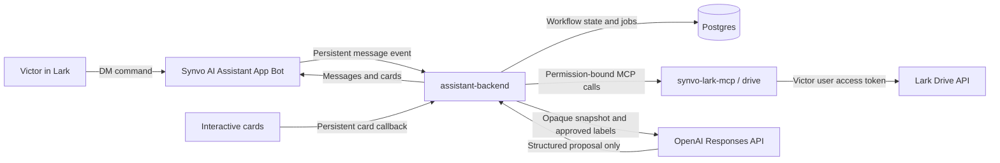

# `/organize-folder` Implementation Plan

Status: Active, with Phase 2 code implemented and live verification pending  
Last updated: 2026-08-07  
Pilot user: Victor  
Workflow owner: TBD  
Engineering owner: TBD

## 1. Purpose

Implement and close the active Synvo Lark Assistant Drive pilot:

```text
/organize-folder <lark-drive-folder-link>
```

The workflow must let the authorized pilot user:

1. Invoke the workflow from a direct Lark conversation.
2. Authorize access to one allowlisted My Space folder.
3. Inspect a complete bounded Folder Map.
4. Review a small structured set of file-move suggestions.
5. Select and explicitly approve the exact moves.
6. Apply only the approved moves.
7. Verify the resulting parent folder of every attempted file.
8. Receive an exact success, partial-success, no-change, or failure report.
9. Review and approve best-effort undo.
10. Verify every attempted undo.

The loop is not closed when the bot merely lists files or produces a convincing proposal.
It is closed only when the complete request-to-verified-outcome journey, including failure and recovery paths, works reliably.

## 2. Relationship to `/organize-wiki`

`/organize-folder` is the active writable pilot because Victor does not have permission to reorganize a Synvo Wiki space.
It validates the shared trusted-assistant mechanics against a real Lark resource that Victor can safely mutate.

Closing the Drive pilot proves:

- Lark bot interaction.
- Lark user OAuth.
- Bounded retrieval.
- Structured proposals.
- Exact approval.
- Deterministic execution.
- Verification.
- Durable audit.
- Partial-failure handling.
- Best-effort undo.

It does not validate:

- Wiki node traversal.
- Wiki object types and shortcuts.
- Wiki permission filtering.
- Same-space or subtree rules.
- Wiki Move Node behavior.
- Wiki verification or undo.

The archived Wiki plan remains a future reference.
`/organize-wiki` remains open until its own mutation loop passes against a writable non-production Wiki.

## 3. Current verified baseline

The repository contains the Phase 1 messaging spike and the local Phase 2 OAuth and read-only Drive inventory implementation.

Verified live on 2026-08-06:

- [x] The custom app has the Bot feature.
- [x] The tenant scopes `im:message.p2p_msg:readonly` and `im:message:send_as_bot` are enabled.
- [x] The `im.message.receive_v1` event is subscribed.
- [x] Message events use the persistent-connection mode.
- [x] A pilot release was approved for Victor.
- [x] The local backend established the persistent connection.
- [x] Victor sent `/ping` in Lark and received `pong`.
- [x] The backend logged one received message and one reply.

Implemented and verified locally on 2026-08-07:

- [x] `/organize-folder` command parsing and exact Lark Drive folder-link validation.
- [x] Exact root token allowlisting without exposing the token in model or user output.
- [x] OAuth 2.0 Authorization Code handling through Lark's documented browser OAuth token endpoint, with state, PKCE `S256`, actor binding, tenant binding, encrypted token storage, and locked refresh-token rotation.
- [x] A loopback HTTP server with `/health`, `/oauth/lark/start`, and `/oauth/lark/callback` routes.
- [x] Two versioned PostgreSQL migrations, durable OAuth and workflow records, durable message-event deduplication, and exact migration-ledger readiness checks.
- [x] A leased event inbox and encrypted delivery outbox with bounded retries, expiration, stale-attempt guards, and idempotent Lark message identifiers.
- [x] Leased scan execution with encrypted cached success or terminal safe-error results and stale-attempt guards.
- [x] Retryable scan release and bounded retry exhaustion with an encrypted generic no-change result.
- [x] A Docker Compose PostgreSQL development service bound to `127.0.0.1`.
- [x] A private stdio `synvo-lark-mcp` server with one bounded read-only `drive_scan_folder` tool.
- [x] Full folder-list pagination, root and child metadata lookup, owner-signal checks, normalized safe errors, and a compact Lark inventory formatter.
- [x] The Phase 2 OAuth scope contract contains `space:document:retrieve`, `drive:drive.metadata:readonly`, and `offline_access`.
- [x] `ORGANIZE_FOLDER_WRITE_ENABLED` defaults to and is required to remain `false` in Phase 2.
- [x] Type checking passes.
- [x] Docker Compose configuration renders successfully.

The following live checks remain incomplete:

- [ ] Add the three Phase 2 user scopes in the Lark Developer Console.
- [ ] Register the exact OAuth redirect URI.
- [ ] Publish a Victor-only version and obtain any required tenant-admin approval.
- [ ] Complete Victor's initial OAuth bootstrap from Lark.
- [ ] Pin the matching verified Victor and Synvo tenant identity pair in private configuration without printing either value.
- [ ] Restart the backend and complete a second inventory run with the static identity allowlist active.
- [ ] Return and visibly verify the exact two-folder and four-file inventory from the pinned rerun in Lark.
- [ ] Require the redacted live verifier to pass the grant, run, delivery, identity, and inventory gates.

The following later capabilities remain unimplemented:

- [ ] GPT integration.
- [ ] Interactive-card callbacks.
- [ ] Drive move tools or any other Drive mutation path.
- [ ] Approval, mutation, verification, and undo records.
- [ ] Phase 3 mutation, verification, and undo workers.

Do not report Phase 2 as complete until its live exit gate passes.

## 4. Exact pilot sandbox

The active sandbox is:

```text
Drive/
└── My Folders/
    └── Test_Synvo_AI_Assistant/
        ├── Product/
        ├── Research/
        ├── [research] - Agentic Context Engineering Research.pdf
        ├── [research] - Anthropic Agentic Engineering.pdf
        ├── [product] - Local_Cocoa_PDF_Chunking_Technical_Guide.pdf
        └── [product] - Local_Cocoa_Technical_Onboarding_Guide.pdf
```

### 4.1 Allowlisted scope

- One exact root folder token identifies `Test_Synvo_AI_Assistant`.
- One exact folder token identifies `Product`.
- One exact folder token identifies `Research`.
- Victor is the only live pilot user initially.
- Only direct `file` children of the root are eligible move sources.
- Only `Product` and `Research` are valid destination folders.
- The workflow may list the root and those two destinations.
- The workflow must not recursively scan deeper folders during the first pilot.
- The workflow must not scan the My Folders root.
- The workflow must not accept an arbitrary Shared Folder or another My Space folder.
- The workflow must identify resources by tokens internally, not by names alone.

### 4.2 Initial expected state

- The root contains exactly two approved folders and four PDF files.
- The `Product` folder is empty.
- The `Research` folder is empty.
- Each source file has the root folder as its observed parent.
- The starting hierarchy is recorded before any automated mutation test.

If the observed state differs, the capability test must stop and report the difference.
It must not silently repair the sandbox.

### 4.3 Expected organized state

After applying the complete approved fixture plan:

- `Research` contains both `[research]` PDFs.
- `Product` contains both `[product]` PDFs.
- The root contains no eligible PDF source files.
- A second scan proposes zero moves.

### 4.4 Expected restored state

After a complete approved undo:

- All four PDFs are direct children of the root again.
- Both approved destination folders are empty again.
- Every file token matches the original snapshot.

## 5. Pilot contract

### 5.1 Included

- One allowlisted My Space root.
- One direct Lark conversation with the pilot bot.
- One authorized pilot user.
- Two existing approved destination folders.
- Four root-level PDF fixtures.
- Maximum four selected moves in the initial live run.
- Filename metadata for the deterministic and title-only GPT stages.
- A compact Lark text or card Folder Map.
- Exact selection and approval.
- Sequential file moves.
- External-state verification after every move.
- Known-state partial-failure reporting.
- Separately approved and verified undo.
- Audit records and lightweight feedback.

### 5.2 Excluded

- Moving folders.
- Moving shortcuts.
- Moving nested source files.
- Moving files outside the allowlisted root.
- Moving files to Shared Folders, Wiki spaces, or another My Space root.
- Creating, renaming, deleting, copying, uploading, or rewriting resources.
- Changing owners, collaborators, permissions, or sharing settings.
- Crawling My Space.
- Automatically applying a full proposal.
- Giving a GPT model any mutation tool.
- Downloading PDF bodies before explicit approval.
- Building a general-purpose organizer or provider framework.
- Claiming that Drive results close `/organize-wiki`.

### 5.3 Safe limit behavior

The first pilot accepts only the exact sandbox root.
Any other root must fail before listing its contents.

If the folder contains more items than the configured budget, the workflow must stop before analysis.
It must ask the user to restore or narrow the sandbox.
It must not silently truncate and present an incomplete plan as complete.

## 6. Fixture and model modes

The current filename prefixes are test labels.
They provide known expected destinations but do not prove GPT capability.

### 6.1 Deterministic fixture mode

The first execution-path test may use:

```text
[research] -> Research
[product]  -> Product
anything else -> abstain
```

Every proposal generated this way must declare:

```json
{
  "analysis_mode": "fixture_label",
  "evidence_type": "filename_prefix"
}
```

This mode validates workflow plumbing only.

### 6.2 GPT title-only mode

For the first GPT integration:

- Strip `[research]` or `[product]` before creating model-visible titles.
- Retain the expected label only in test metadata.
- Send only the normalized title and an opaque item reference.
- Offer only the approved destinations `Product` and `Research` plus `abstain`.
- Label every result `title_only`.

The four titles are an integration smoke test.
Four correct answers are not a production-quality evaluation.

### 6.3 Future content-aware mode

Do not download PDF bodies during the initial plumbing loop.

Content-aware analysis requires:

- Explicit approval of the model-provider data-handling policy.
- The narrower `drive:file:download` user scope.
- File-size and page-count limits.
- PDF text-extraction limits.
- Handling for encrypted, scanned, empty, malformed, and oversized PDFs.
- Prompt-injection treatment.
- Raw-content retention and deletion rules.

An alternative is to add synthetic native Lark Docs and use `docx:document:readonly`.

## 7. Architecture



### 7.1 Transport decisions

Direct-message events use the working persistent connection.
Persistent connection authentication is handled by the official Lark SDK.

Interactive-card callbacks also use the official SDK persistent connection.
Lark Event Configuration and Callback Configuration remain separate console settings even though they share the connection.
Subscribe to `im.message.receive_v1` under Event Configuration and the current `card.action.trigger` under Callback Configuration.
Do not subscribe to the legacy `card.action.trigger_v1` callback.
Card action `value` fields must be JSON objects.
Persist and deduplicate callback IDs, and return the callback response within three seconds.

OAuth requires an exact registered redirect URI.
Project policy requires HTTPS for deployed OAuth redirects.
The single-machine local pilot uses `http://localhost:3000/oauth/lark/callback` and must complete OAuth from Lark Desktop or a browser on that same machine.
The exact staging redirect is `https://lark-assistant-staging.synvo.ai/oauth/lark/callback` when the staging host is available.
Victor does not currently control Synvo DNS or domain configuration.
For staging, Victor's manager or Synvo domain administrator must provision the DNS record and managed HTTPS route, register the exact staging redirect in Lark, and publish or approve the corresponding restricted app version.
Those staging actions do not block the single-machine localhost Phase 2 pilot.
Local development may instead use an explicitly registered stable HTTPS tunnel if the callback must be reached from another device.
The configured environment value, authorization request, and registered redirect must match character for character.
When card callbacks use the persistent connection, OAuth is the only required inbound HTTP route for this pilot.

### 7.2 Component ownership

`assistant-backend` owns:

- Persistent Lark message ingestion.
- Persistent Lark card-callback ingestion.
- OAuth routes.
- Command parsing.
- User-visible acknowledgement and progress.
- Workflow state.
- Background jobs.
- GPT calls and prompt versions.
- Immutable plans.
- Selection and approval grants.
- Execution orchestration.
- Lark messages and cards.

`synvo-lark-mcp` owns:

- The policy-enforced Drive module.
- Folder-link and token resolution.
- Bounded folder listing.
- Drive error normalization.
- Server-owned move-manifest execution.
- Post-operation observation and verification.
- Server-owned undo-manifest execution.

Shared packages own:

- OAuth protocol and encrypted token handling.
- Typed workflow contracts.
- Organizer policies.
- Audit schemas.
- Stable error codes.

The GPT model must never invoke `synvo-lark-mcp` directly.
The assistant backend is the deterministic orchestrator between model output and tools.

### 7.3 Implemented Phase 2 code locations

```text
apps/
├── assistant-backend/
│   └── src/
│       ├── commands.ts
│       ├── config.ts
│       ├── db/
│       │   ├── migrate.ts
│       │   └── pool.ts
│       ├── delivery/
│       │   ├── crypto.ts
│       │   ├── repository.ts
│       │   └── worker.ts
│       ├── http/server.ts
│       ├── mcp/client.ts
│       ├── oauth/
│       │   ├── pkce.ts
│       │   └── service.ts
│       ├── repositories/
│       │   ├── inbox.ts
│       │   └── phase2.ts
│       └── workflows/
│           └── organize-folder/
│               ├── format-inventory.ts
│               └── service.ts
└── synvo-lark-mcp/
    └── src/
        ├── config.ts
        ├── server.ts
        ├── repositories/run-context.ts
        └── modules/
            └── drive/
                ├── client.ts
                ├── errors.ts
                ├── folder-link.ts
                └── scan-folder.ts

packages/
├── contracts/
└── lark-auth/

database/
└── migrations/
    ├── 0001_phase2_oauth_and_scan.sql
    └── 0002_phase2_delivery_recovery.sql
```

Phase 3 and later files for mutation manifests, approval, verification, undo, policy, audit, and GPT integration are intentionally absent.
Add those files only when the corresponding active phase requires them.
The resource-specific Drive adapter and workflow must remain explicit.
Do not build a generic provider registry.

## 8. Lark permissions and OAuth

### 8.1 Existing bot tenant scopes

- `im:message.p2p_msg:readonly`
- `im:message:send_as_bot`

Do not add group message scopes during the direct-message pilot.

### 8.2 Phase 2 user OAuth scopes

- `space:document:retrieve` for listing items in the selected My Space folder.
- `drive:drive.metadata:readonly` for the narrow root-title and root-owner metadata lookup required by the current scanner.
- `offline_access` for refresh-token access.

The folder-list response includes metadata for child items, including owner IDs.
The selected root is not returned as its own child, so the current root-owner invariant requires the narrow metadata scope.

Forbidden during Phase 2:

- `space:document:move`.
- `drive:file:download`.
- `drive:file:readonly`.
- `drive:drive:readonly`.
- `drive:drive`.
- Any PDF or native Lark Docs content-read scope.

Add `space:document:move` only for the separately reviewed Phase 3 capability spike.
Add a content scope only when a later content-aware phase has an approved data-handling and retention policy.

### 8.3 OAuth flow

Implement OAuth 2.0 Authorization Code using Lark's documented browser OAuth token endpoint with:

- A high-entropy state value.
- PKCE with `S256`.
- An exact registered redirect URI.
- A short-lived single-use authorization code.
- Server-side code exchange.
- `offline_access`.
- User information lookup.
- Actor and tenant binding.

The callback must:

1. Validate state.
2. Validate the exact redirect session.
3. Exchange the code server-side.
4. Fetch the authorized user's identity.
5. Verify that the returned `open_id` matches the bot requester.
6. Verify that the tenant is the expected Synvo tenant.
7. Encrypt and store the access token, rotating refresh token, granted scopes, `access_expires_at` derived from `expires_in`, and `refresh_expires_at` derived from `refresh_token_expires_in`.
8. Return the user to a clear Lark success or failure message.

Refresh tokens rotate and are single-use.
Serialize refresh attempts under a database lock and atomically store the replacement token.
Use the expiry values returned by Lark rather than assumed sample durations.
Require a new OAuth authorization after terminal refresh expiry or revocation.

### 8.4 Release behavior

The app release must remain restricted to Victor during the personal My Space pilot.
Bot capability, scope, and event-subscription changes must be included in a new restricted version and submitted for any approval required by Synvo tenant policy.
Save the exact OAuth redirect under Lark Security Settings before beginning OAuth testing.
Follow the Developer Console release banner if Lark marks a redirect or callback setting change as requiring publication.

Do not use `Test Companies & Users` for this flow.
That isolated tenant cannot access Victor's real Synvo My Space folder.

## 9. MCP contracts

Keep the MCP surface workflow-specific.
Do not expose a generic `call_lark_api` or arbitrary `move_file` tool.

### 9.1 Read-only scan

```typescript
drive_scan_folder({
  run_id
}) => {
  scan_id,
  snapshot_hash,
  complete,
  truncation_reasons,
  root_ref,
  items
}
```

The assistant backend creates the run record after parsing the folder URL and binding the Lark requester to an OAuth grant.
The MCP module loads the server-owned run, actor, tenant, root policy, limits, and grant association by `run_id`.
The tool must not accept a caller-supplied user ID, OAuth token, native Drive token, folder URL, or policy limit.

The result uses run-scoped opaque references.
Native file tokens, folder tokens, and OAuth credentials must not enter model context.

### 9.2 Apply approved plan

```typescript
drive_apply_approved_plan({
  mutation_batch_id,
  idempotency_key
}) => {
  batch_id,
  status,
  results
}
```

The assistant backend atomically consumes approval and creates the mutation batch before invoking the tool.
The tool loads the server-owned immutable manifest and grant association by `mutation_batch_id`.
It must not accept arbitrary source or destination tokens from model output.

### 9.3 Undo approved run

```typescript
drive_undo_approved_run({
  undo_batch_id,
  idempotency_key
}) => {
  undo_batch_id,
  status,
  results
}
```

The tool builds or loads a server-owned reverse manifest.
It must verify the current external state before every reverse move.

### 9.4 Backend-to-MCP trust boundary

- Keep the MCP transport private to the application deployment.
- Authenticate `assistant-backend` to `synvo-lark-mcp` with a deployment-managed service identity or an equivalently scoped local process boundary.
- Authorize every call for the exact operation and server-owned record named in the request.
- Load OAuth credentials through a server-side token broker or encrypted grant store.
- Never put OAuth credentials, App Secrets, actor IDs, native Drive tokens, or plaintext approval grants in MCP arguments.
- Never write credentials or native Drive tokens to logs.
- Store actor identity only in the access-controlled workflow and audit records that require it.
- Propagate a redacted correlation ID for audit without treating it as authorization.
- Reject public, unauthenticated, cross-tenant, missing-record, mismatched-purpose, and already-consumed batch calls.

## 10. Drive API behavior

### 10.1 List items in a folder

```http
GET /open-apis/drive/v1/files
    ?folder_token=<allowlisted-folder-token>
    &page_size=200
    &page_token=<optional>
Authorization: Bearer <user_access_token>
```

The adapter must continue pagination until `has_more=false`.
It must detect repeated cursors and pagination loops.
It must enforce request, item-count, and deadline budgets.

### 10.2 Move one file

```http
POST /open-apis/drive/v1/files/{file_token}/move
Authorization: Bearer <user_access_token>
Content-Type: application/json

{
  "type": "file",
  "folder_token": "<approved-destination-token>"
}
```

The external API does not provide the workflow's idempotency guarantee.
The application must use durable internal uniqueness and state reconciliation.

Never trust a successful response alone.
Re-list the source and destination and verify the exact file token and observed parent.

### 10.3 Retry rule

Reads may use bounded retry for explicitly retryable errors.
Move calls must not be retried blindly.

If a move times out or its response is lost:

1. Re-list the source.
2. Re-list the approved destination.
3. Find the exact file token.
4. Treat the approved destination as success only if the observed parent matches.
5. Treat the expected source parent as not applied.
6. Enter `NEEDS_ATTENTION` if the file cannot be located or has an unexpected parent.

### 10.4 Metadata fingerprints and pilot authorization

Before displaying a plan, compute server-side canonical fingerprints from Lark metadata.

The source metadata digest includes:

- Native token.
- Native type.
- Parent token.
- Normalized title.
- Modified time.
- Owner identity.

The destination identity digest includes:

- Native token.
- Native type.
- Root parent token.
- Normalized folder label.
- Owner identity.

Native values remain in trusted storage and never enter model context.
If the selected Lark listing response omits a required field, fetch it through the narrowest authorized metadata API before planning.
If a complete fingerprint or the Victor-ownership invariant cannot be established, the pilot must remain read-only.

Immediately before the first write, recompute every selected source and destination digest.
Any mismatch makes the whole plan stale and aborts the batch with zero writes.
For this personal My Space pilot, root, source, and destination ownership by the bound OAuth user is the resource-level authorization invariant.
Shared or non-owned resources require a separate explicit manageability check and are out of scope.

## 11. Workflow state machine

```text
RECEIVED
-> VALIDATING
-> AWAITING_OAUTH
-> SCANNING
-> ANALYZING
-> PLAN_READY
-> AWAITING_SELECTION
-> AWAITING_APPROVAL
-> PREFLIGHT
-> APPLYING
-> VERIFYING
-> COMPLETED | COMPLETED_NO_CHANGE | PARTIALLY_COMPLETED | NEEDS_ATTENTION
```

No-write terminal states:

```text
REJECTED
CANCELLED
EXPIRED
FAILED_NO_CHANGE
STALE_NO_CHANGE
```

Undo states:

```text
UNDO_AWAITING_APPROVAL
-> UNDO_PREFLIGHT
-> UNDOING
-> UNDO_VERIFYING
-> UNDONE | UNDO_PARTIAL | UNDO_NEEDS_ATTENTION
```

Every transition must be explicit and persisted.
Illegal transitions must fail closed.

## 12. Phase overview

| Phase | Outcome | Status |
|---|---|---|
| 0 | Pilot contract, sandbox, and data policy are locked | Safeguards confirmed; policy records in progress |
| 1 | Lark direct-message connection spike works | Complete |
| 2 | Victor OAuth and read-only Drive inventory work | Code implemented; live verification pending |
| 3 | One PDF completes a verified move-and-restore round trip | Not started |
| 4 | Read-only MCP snapshot and deterministic proposal work in Lark | Not started |
| 5 | GPT title-only proposals are structured and policy-valid | Not started |
| 6 | Exact card selection and approval are replay-safe | Not started |
| 7 | Deterministic all-four execution and a GPT subset run are verified | Not started |
| 8 | Approved undo and conflict handling work | Not started |
| 9 | Security, recovery, and closure gates pass | Not started |

## 13. Phase 0: lock the pilot

### Goal

Remove ambiguity about the sandbox, permissions, test data, and closure language.

### Work items

- [x] Capture the exact root folder token in ignored local secret configuration.
- [ ] Capture the exact `Product` folder token.
- [ ] Capture the exact `Research` folder token.
- [ ] Record the starting file tokens, types, names, and parent tokens.
- [ ] Record the expected Victor owner identity for the root, destinations, and four source files.
- [x] Confirm both destination folders are empty.
- [x] Confirm the four PDFs are disposable test copies.
- [x] Confirm no PDF body will be opened, downloaded, retained, or sent to GPT during metadata-only plumbing phases.
- [ ] Define raw metadata, token, audit, and OAuth retention periods.
- [ ] Define a sandbox reset procedure.
- [ ] Configure the authorized tenant and Victor `open_id` allowlist.
- [x] Restrict the released app availability to Victor.
- [x] Add `ORGANIZE_FOLDER_WRITE_ENABLED` as the immediate write kill switch independent of deployment.
- [x] Keep `ORGANIZE_FOLDER_WRITE_ENABLED=false` throughout Phase 2.
- [x] Keep content download unavailable by omitting content scopes and content tools.
- [ ] Add later-phase proposal, approval, and undo controls only when those phases require them.

### Required tests

- [x] The My Folders root is rejected.
- [x] A sibling folder is rejected.
- [x] A Shared Folder is rejected.
- [x] A duplicate folder name with the wrong token is rejected.
- [x] An unexpected starting hierarchy stops safely.

### Exit gate

- The exact permitted and forbidden scope is documented.
- The sandbox baseline is machine-readable and restorable.
- The test data policy is approved.
- Every open decision has an owner.

## 14. Phase 1: messaging foundation

### Goal

Prove the direct Lark message-to-backend-to-Lark response path.

### Completed work

- [x] Add the Bot feature.
- [x] Add the two direct-message scopes.
- [x] Subscribe `im.message.receive_v1`.
- [x] Select persistent-connection event delivery.
- [x] Release the pilot version to Victor.
- [x] Scaffold the TypeScript assistant backend.
- [x] Validate required App ID and App Secret environment variables.
- [x] Ignore bot senders, group messages, and non-text messages.
- [x] Implement `/ping -> pong`.
- [x] Establish a live persistent connection.
- [x] Verify `/ping -> pong` manually in Lark.
- [x] Pass type checking and five unit tests.

### Limitations recorded at the Phase 1 exit

- The original connection spike used in-memory message deduplication.
- Phase 2 supersedes that limitation with a PostgreSQL-backed durable inbox constraint.
- Phase 2 also adds a leased inbox worker and an encrypted durable delivery outbox with bounded recovery.
- The process is still local only.
- Card callbacks are not configured.

### Exit gate

The connection spike is complete.
Consequential workflow execution remains disabled.

## 15. Phase 2: OAuth and read-only Drive inventory

### Goal

Bind Victor's Lark bot identity to a user OAuth grant and list the exact sandbox without any mutation capability.

### Work items

- [x] Define the minimum user scope contract as `space:document:retrieve`, `drive:drive.metadata:readonly`, and `offline_access`.
- [ ] Add the three minimum user scopes in the Lark Developer Console.
- [ ] Register `http://localhost:3000/oauth/lark/callback` for the single-machine local pilot.
- [ ] Register `https://lark-assistant-staging.synvo.ai/oauth/lark/callback` when the staging host is available.
- [ ] Release the scope change to Victor and obtain any required tenant-admin approval.
- [x] Add a loopback-only PostgreSQL development service and two versioned Phase 2 migrations.
- [x] Add a migration runner that needs only `DATABASE_URL`.
- [x] Add schema-aware startup and health readiness checks.
- [x] Start PostgreSQL and apply both migrations on the normal development host.
- [x] Run the separate Docker-backed PostgreSQL integration suite against the migrated local database.
- [x] Create pending OAuth-session and encrypted OAuth-grant records.
- [x] Implement OAuth start and callback routes.
- [x] Implement state and PKCE validation.
- [x] Fetch and validate the authorized user identity.
- [x] Bind OAuth `open_id` and tenant to the pending bot requester.
- [x] Encrypt and persist rotating tokens, `access_expires_at`, and `refresh_expires_at` from the exact response fields.
- [x] Implement locked atomic token refresh.
- [x] Enforce the exact three-scope contract on OAuth callback responses, stored grants, and refresh responses.
- [x] Persist terminal revocation when Lark returns OAuth `invalid_grant`.
- [x] Scaffold `apps/synvo-lark-mcp`.
- [x] Implement the explicit read-only Drive module.
- [x] Route all Drive API access through that module.
- [x] Implement the read-only `drive_scan_folder` tool.
- [x] Parse a Lark Drive folder link without accepting arbitrary external URLs.
- [x] Resolve and require the exact allowlisted root token.
- [x] List the root with full pagination.
- [x] List both approved destinations for baseline verification.
- [x] Implement root, destination, and source-file owner-signal checks.
- [x] Re-list the root and both destinations after their initial scans and reject concurrent identity or content changes.
- [ ] Confirm the owner signals against live Lark responses for Victor's sandbox.
- [x] Normalize authorization, not-found, rate-limit, server, timeout, pagination, and malformed-response failures into safe errors.
- [x] Treat nested Node fetch DNS, connection-reset, socket, and timeout failures as retryable without exposing provider detail.
- [x] Refresh once under a lock after a Drive 401 or invalid-token response, retry only that read once, and never refresh after a Drive 403.
- [x] Add leased, crash-recoverable scan execution with encrypted cached terminal results.
- [x] Add a leased durable event inbox and encrypted Lark delivery outbox with bounded retry and expiration.
- [x] Deliver a generic terminal no-change message if retryable scan preparation exhausts its bounded attempts.
- [x] Add a safe identity-pinning helper that rechecks the complete delivered bootstrap gate and atomically updates the private `0600` environment file without printing the identity pair.
- [x] Keep MCP input limited to a server-owned `run_id` and validate strict token-free result envelopes.
- [x] Implement the Lark text response for a bounded read-only inventory.
- [x] Sanitize control, bidi, mention-markup, URL, and overlong display values before Lark rendering.
- [ ] Return and verify the bounded inventory in live Lark.
- [x] Keep `ORGANIZE_FOLDER_WRITE_ENABLED=false` and expose no write tool.

### Expected inventory

The root scan must find:

- Two objects of type `folder`.
- Four objects of type `file`.
- No unexpected child object.

The destination scans must both be empty.

### Required tests

- [x] Missing, expired, revoked, and wrong-scope grants.
- [x] OAuth state mismatch and callback replay.
- [x] PKCE mismatch and ciphertext rebinding.
- [x] Different user completes OAuth.
- [x] Different tenant completes OAuth.
- [x] Lark user-identity HTTP request, response mapping, malformed identity, and safe provider failure.
- [x] Concurrent refresh attempts.
- [x] Rotating refresh-token replacement.
- [x] Rotated refresh-token ciphertext and both replacement expiry timestamps.
- [x] OAuth `invalid_grant`, one-time Drive 401 recovery, second token rejection, and Drive 403 without refresh.
- [x] Malformed, external, root, sibling, and unallowlisted folder links.
- [x] Folder-list pagination, repeated cursor, and item budget.
- [x] Root revalidation, destination relocation, metadata-title races, and unexpected hierarchy.
- [x] Destination-content races, nonempty destinations, missing or duplicate destinations, unsupported root objects, and an extra root file.
- [x] Permission-safe errors reveal no outside-root token or provider detail.
- [x] Phase 2 schema readiness and missing-table failure.
- [x] Expired scan and delivery lease recovery, stale-attempt rejection, bounded retry, and encrypted cached results.
- [x] Real PostgreSQL scan-lease recovery, stale-result rejection, and atomic ready-run plus delivery-job creation.
- [x] MCP reconnection and strict token-free input and output contracts.
- [x] Lark-facing inventory rendering, internal-reference exclusion, and untrusted display-value sanitization.
- [x] Redacted live-exit verification of the latest run, joined grant, completed delivery, and authenticated cached inventory without printing sensitive fields.
- [x] Safe identity pinning, no-op, duplicate, partial, mismatch, unsafe-file, atomic-update, mode, and output-redaction behavior.

### Local verification status

- `npm run typecheck` passes.
- The default unit and contract suite discovers 237 tests, and all 237 pass.
- The separate Docker-backed PostgreSQL integration suite discovers five tests, and all five pass against the migrated local database.
- `docker compose config` succeeds.
- The Docker PostgreSQL container is healthy, both migrations are applied, and the backend health endpoint reports Phase 2 read-only mode.
- `npm audit --omit=dev --offline` reports no vulnerability from the locally cached advisory data.
- A fresh online advisory query remains a production-release check because it requires explicit approval to send dependency metadata to the npm registry.
- A live Lark OAuth grant and Drive inventory remain unverified.

### Exit gate

- [ ] The live grant has the exact scopes, a future refresh expiry, no revocation timestamp, and a valid refresh version.
- [ ] The latest live inventory run has terminal state `COMPLETED` with no terminal error.
- [ ] A request lists exactly two folders and four PDFs.
- [ ] The bot reports a bounded read-only inventory in Lark.
- [ ] The live root, destinations, and files satisfy the owner-signal policy.
- [ ] No write scope or write path is active in the released Phase 2 app and running services.
- [ ] `npm run verify:phase2-live` returns `pass` with exit code `0` after the visible Lark result is confirmed.

## 16. Phase 3: one-file Drive capability spike

### Goal

Prove one externally verified move and restoration before GPT, cards, or multi-file execution.

### Work items

- [ ] Add `space:document:move` to the user scopes.
- [ ] Publish the scope change and obtain admin approval.
- [ ] Reauthorize Victor with the new grant.
- [ ] Implement a test-only round-trip harness inside the Drive module.
- [ ] Keep the harness unavailable as a production MCP tool.
- [ ] Add minimal durable mutation-batch and move-attempt records before the first write.
- [ ] Make the per-direction attempt key unique in the database.
- [ ] Show Victor the exact source, destination, and reverse operation before enabling the harness.
- [ ] Require Victor's explicit operator confirmation for the round trip.
- [ ] Select `[research] - Agentic Context Engineering Research.pdf` by its recorded file token.
- [ ] Confirm it is type `file` and a direct root child.
- [ ] Confirm the Research token is the exact approved destination.
- [ ] Reconfirm that the root, source, and Research destination satisfy the Victor-ownership invariant.
- [ ] Enable the write flag for the single test operation.
- [ ] Move the PDF to Research.
- [ ] Re-list the root and Research.
- [ ] Verify the exact file token has Research as its observed parent.
- [ ] Move the same token back to the root.
- [ ] Re-list the root and Research again.
- [ ] Verify exact baseline restoration.
- [ ] Disable the write flag.
- [ ] Record request IDs, pre-state, responses, post-state, and outcome.
- [ ] Resume an interrupted harness by loading its durable attempt and reconciling observed Drive state.

### Retry and idempotency requirements

- Serialize move calls.
- Create an internal unique key for file token, expected parent, destination, and direction.
- Persist that key and the intent before calling Lark.
- Never issue a second move until the observed state has been reconciled.
- Treat an already-observed approved destination as idempotent success.
- Enter `NEEDS_ATTENTION` when the token has an unexpected or unknown parent.

### Required fault tests

- [ ] Duplicate capability invocation.
- [ ] Source manually moved before preflight.
- [ ] Destination missing.
- [ ] Permission revoked.
- [ ] Timeout before Lark receives the move.
- [ ] Lost response after Lark applies the move.
- [ ] Lark 429 and 5xx.
- [ ] Verification disagrees with the response.

### Exit gate

- One known PDF completes a verified root-to-Research-to-root round trip.
- Duplicate invocation does not duplicate the move.
- Ambiguous outcomes are reconciled.
- The sandbox returns to the exact baseline.
- No result is reported as successful while external state is unknown.

## 17. Phase 4: read-only MCP snapshot and deterministic proposal

### Goal

Invoke `/organize-folder` from Lark and receive a complete, immutable, no-write plan generated from the known fixture labels.

### Work items

- [ ] Extend `drive_scan_folder` from raw listing to a canonical immutable snapshot.
- [ ] Use the authenticated user grant without exposing tokens to the caller.
- [ ] Enforce the exact root and approved destinations.
- [ ] Assign run-scoped opaque references such as `f001` and `d001`.
- [ ] Build a canonical snapshot.
- [ ] Record normalized title, modified time, owner identity, source metadata digest, and destination identity digest.
- [ ] Compute a stable snapshot hash.
- [ ] Persist the workflow run, snapshot, items, and immutable proposal.
- [ ] Store native tokens only in the trusted snapshot record.
- [ ] Implement the deterministic fixture-label classifier.
- [ ] Return `abstain` for unknown labels.
- [ ] Build an immutable structured proposal.
- [ ] Validate every source and destination deterministically.
- [x] Parse `/organize-folder <folder-link>` in the assistant backend.
- [ ] Acknowledge the command immediately.
- [ ] Render the inventory and proposed moves in a Lark message or read-only card.
- [ ] Label the analysis mode `fixture_label`.
- [ ] Keep mutation tools unavailable.

### Proposal schema

```typescript
{
  run_id,
  scan_id,
  snapshot_hash,
  analysis_mode: "fixture_label",
  moves: [{
    move_id,
    source_ref,
    expected_parent_ref,
    destination_ref,
    confidence,
    evidence,
    explanation
  }]
}
```

### Deterministic policy

Every proposal must satisfy:

- The source exists in the immutable snapshot.
- The source is type `file`.
- The source is a direct child of the root.
- The source is not already in the approved destination.
- The destination is one of the two exact approved folders.
- The move remains inside the allowlisted root.
- The move is not duplicated.
- The proposal contains no more than four moves.

### Required tests

- [ ] Exact four-file baseline.
- [ ] Unknown and malformed prefixes.
- [ ] Duplicate names with distinct tokens.
- [ ] Folder-as-source attempt.
- [ ] Source outside root.
- [ ] Destination substitution.
- [ ] No-op move.
- [ ] Snapshot hash stability and change detection.
- [ ] Unsupported object omission.
- [ ] Correctly organized snapshot produces zero moves.

### Exit gate

- The Lark command returns exactly four valid no-write suggestions from the baseline.
- Every suggestion uses an approved destination and declares fixture-label evidence.
- No native token or credential appears in the message, card, or model context.
- A correctly organized snapshot returns `COMPLETED_NO_CHANGE`.

## 18. Phase 5: GPT title-only proposal

### Goal

Replace the deterministic classifier with a structured GPT title-only proposal while hiding fixture labels from the model.

### Work items

- [ ] Approve metadata-only model-provider use for the four test files.
- [ ] Define the title-profile and organization-proposal schemas.
- [ ] Remove fixture prefixes from model-visible titles.
- [ ] Retain expected labels only in test evaluation data.
- [ ] Pass only opaque source references and approved destination references.
- [ ] Include `Product`, `Research`, and `abstain` as the only outcomes.
- [ ] Use the OpenAI Responses API with Structured Outputs.
- [ ] Pin and record the model, prompt, schema, and policy versions.
- [ ] Record latency, token use, refusal, truncation, and validation outcomes.
- [ ] Allow at most one controlled retry for refusal, truncation, or invalid schema.
- [ ] Reject the entire result if it contains unknown references or destinations.
- [ ] Omit low-confidence suggestions.
- [ ] Label every suggestion `title_only`.
- [ ] Keep all mutation tools unavailable to the model.

### Model-visible input example

```json
{
  "items": [
    {
      "ref": "f001",
      "title": "Agentic Context Engineering Research.pdf"
    }
  ],
  "destinations": [
    {
      "ref": "d001",
      "label": "Product"
    },
    {
      "ref": "d002",
      "label": "Research"
    }
  ]
}
```

### Required tests

- [ ] Prefixes are absent from model input and logs.
- [ ] Unknown or invented references.
- [ ] Unknown destination.
- [ ] Invalid schema.
- [ ] Refusal and truncation.
- [ ] Low-confidence abstention.
- [ ] Prompt injection embedded in a title.
- [ ] Deterministic model stubs in CI.
- [ ] Versioned live-model smoke test outside deterministic CI.

### Evaluation caution

The four deliberately clear fixtures are expected to classify correctly in a live integration test.
A low-confidence abstention remains valid and must be reported and investigated rather than overridden.
This result validates integration behavior, not general model quality.

Before content-aware pilot claims, add at least one ambiguous synthetic item that should abstain and a larger approved synthetic evaluation set.

### Exit gate

- Every displayed GPT suggestion passes deterministic policy.
- Fixture prefixes remain hidden from model input.
- Every suggestion includes title evidence, confidence, and explanation.
- The model has no authorization or execution capability.

## 19. Phase 6: exact selection and approval

### Goal

Bind one verified Lark user to one immutable exact set of file moves.

### Work items

- [ ] Configure Callback Configuration to receive `card.action.trigger` through the persistent connection.
- [ ] Register the SDK callback handler before saving the console subscription mode.
- [ ] Keep the legacy `card.action.trigger_v1` callback disabled.
- [ ] Add durable card-callback inbox, outbox, and approval migrations.
- [ ] Reuse the durable mutation-batch and move-attempt records introduced by the capability spike.
- [ ] Persist callback IDs before dispatch.
- [ ] Acknowledge accepted card actions within three seconds.
- [ ] Encode every interactive component `value` as a JSON object.
- [ ] Enqueue long-running work after the callback acknowledgement.
- [ ] Build a selection card with per-move select and reject actions.
- [ ] Build a separate final confirmation card.
- [ ] Make organization plans immutable and versioned.
- [ ] Create stable move IDs.
- [ ] Build an execution manifest containing:
  - Run, scan, and plan IDs.
  - Actor `open_id` and tenant.
  - Root folder and provider.
  - Snapshot and plan hashes.
  - Exact selected move IDs.
  - Source file type, expected parent, normalized title, modified time when available, owner, and metadata digest.
  - Approved destination reference, label, root parent, owner, and identity digest.
  - Selection expiry.
- [ ] Canonically serialize and hash the manifest.
- [ ] Verify that the callback actor is the expected pilot user.
- [ ] Create a random single-use opaque approval grant.
- [ ] Store only the approval-grant digest.
- [ ] Bind the grant to actor, tenant, plan, selection, purpose, and expiry.
- [ ] Keep grants out of cards and model context.
- [ ] Atomically consume approval when creating one mutation batch.
- [ ] Return the existing batch on callback replay.
- [ ] Invalidate approval when selection or plan changes.

### Recommended pilot policy

- Approval expires after 10 minutes.
- Selection and final approval are separate interactions.
- A refreshed or changed plan always requires new approval.
- Apply approval cannot authorize undo.
- Only the original requesting user may approve.

### Required tests

- [ ] Callback actor substitution.
- [ ] Tenant substitution.
- [ ] Plan, source, destination, and selection substitution.
- [ ] Expired, revoked, and consumed grants.
- [ ] Concurrent duplicate callbacks.
- [ ] Selection change invalidates prior approval.
- [ ] Wrong-purpose grant.
- [ ] Callback timeout and retry.

### Exit gate

- No mutation can start without exact unexpired actor-bound approval.
- Replay and concurrent callbacks create at most one mutation batch.
- Altering any selected move changes the manifest hash and invalidates approval.

## 20. Phase 7: apply, verify, and no-op rerun

### Goal

Move the exact approved files sequentially, verify every result, and leave failures in a known state.

### Work items

- [ ] Implement `drive_apply_approved_plan`.
- [ ] Keep the write tool unavailable to GPT.
- [ ] Enable `ORGANIZE_FOLDER_WRITE_ENABLED` only for the supervised execution window.
- [ ] Lock overlapping apply batches for the same root.
- [ ] Atomically consume approval and create the mutation batch.
- [ ] Compute a unique internal key for each file, destination, and direction.
- [ ] Preflight the entire selected batch before the first move.
- [ ] Verify the OAuth actor and tenant.
- [ ] Re-scan the root and destinations.
- [ ] Require each source to remain type `file` and a direct root child.
- [ ] Require every destination to remain an approved direct child folder.
- [ ] Compare every source metadata digest with the approved snapshot.
- [ ] Compare every destination identity digest with the approved snapshot.
- [ ] Require every pilot source, root, and destination owner to match the approving OAuth user.
- [ ] Require any provider-exposed manageability signal when available.
- [ ] Treat missing or mismatched ownership or manageability metadata as a whole-batch preflight failure.
- [ ] Abort with zero writes if whole-batch preflight fails.
- [ ] Execute moves sequentially.
- [ ] Re-read current parent before every move.
- [ ] Treat an already-correct destination as idempotent success.
- [ ] Reconcile any timeout or ambiguous response before retry.
- [ ] Re-list source and destination after each move.
- [ ] Mark success only when the exact file token has the approved parent.
- [ ] Stop on the first unexpected failure or verification mismatch.
- [ ] Mark remaining moves `UNTOUCHED`.
- [ ] Reconcile every attempted file before the final report.
- [ ] Report `succeeded`, `failed`, `unknown`, and `untouched` separately.
- [ ] Disable the write flag after the supervised run.

### Required fault tests

- [ ] Source moved manually after approval.
- [ ] Destination missing after approval.
- [ ] Permission revoked before execution.
- [ ] Duplicate apply callback.
- [ ] Timeout before Lark receives a move.
- [ ] Response lost after Lark applies a move.
- [ ] Lark 429 or 5xx.
- [ ] Failure on move N.
- [ ] Worker crash before and after an ambiguous response.
- [ ] Lark response says success but observation disagrees.

### Live acceptance

Deterministic execution coverage:

- The fixture-label plan moves both research PDFs to `Research` and both product PDFs to `Product`.
- No eligible PDF remains in the root.
- The final card links every outcome to the corresponding move ID.
- A second `/organize-folder` run in fixture-label mode returns `COMPLETED_NO_CHANGE`.
- Verified undo restores the exact baseline.

GPT title-only behavior:

- A separate reset-baseline run uses a prefix-hidden GPT title-only proposal that passes deterministic validation.
- GPT may return a validated subset and abstain on uncertain files.
- At least one selected GPT suggestion completes approval, move, verification, and undo.
- Every abstention remains untouched and is reported clearly.
- Closure does not require GPT to force all four files into destinations.

### Exit gate

- At most one external move occurs for each approved move ID.
- Every claimed success is independently verified.
- No ambiguous response causes a blind retry.
- Partial failures end with exact known outcome sets.
- The no-op second run passes.

## 21. Phase 8: undo and recovery

### Goal

Provide a separately approved and verified reversal for files successfully moved by the workflow.

### Work items

- [ ] Store original and applied parent for every verified move.
- [ ] Build a reverse manifest only for verified successes.
- [ ] Add a `Review undo` interaction.
- [ ] Show exact reverse operations in a confirmation card.
- [ ] Require a new actor-bound single-use approval.
- [ ] Revalidate actor, token grant, source, current parent, original parent, and type.
- [ ] Allow undo only when current parent still equals the destination applied by the run.
- [ ] Preserve later human changes.
- [ ] Execute reverse moves in reverse original execution order.
- [ ] Verify every resulting root parent.
- [ ] Report `undone`, `already_undone`, `conflicted`, `failed`, and `untouched` separately.
- [ ] Keep the original apply outcome immutable.
- [ ] Store undo as a separate mutation batch.
- [ ] Return `ORGANIZE_FOLDER_WRITE_ENABLED` to `false` after the supervised undo test.

### Required tests

- [ ] Successful full undo.
- [ ] Partial undo.
- [ ] Duplicate undo callback.
- [ ] File already manually restored.
- [ ] File moved elsewhere after apply.
- [ ] Root inaccessible.
- [ ] Permission revoked before undo.
- [ ] Timeout and worker crash during undo.

### Live acceptance

- All four PDFs return to the root.
- Both destinations are empty.
- The same file tokens are observed.
- A second undo request is a no-op.
- A manually moved conflict remains untouched and is reported.

### Exit gate

- Undo is independently approved, idempotent, and externally verified.
- Conflicts never overwrite later human changes.
- Partial undo always has a known and accurately reported state.

## 22. Phase 9: hardening and closure review

### Goal

Demonstrate safe failure, durable recovery, observability, and an honest closure decision.

### 22.1 Durability

- [ ] Verify all migrations on a clean Postgres instance.
- [ ] Verify that the unique durable inbox replaces in-memory replay protection for workflow actions.
- [ ] Verify the transactional outbox or equivalent durable job handoff.
- [ ] Add optimistic locking or explicit state-transition guards.
- [ ] Recover jobs after worker restart.
- [ ] Persist correlation IDs across Lark, OAuth, MCP, GPT, and Drive calls.

### 22.2 Security

- [ ] Test forged card callbacks.
- [ ] Test cross-user plan, run, approval, and OAuth access.
- [ ] Test outside-root discovery through counts, errors, logs, and cards.
- [ ] Test prompt injection and fake tool-call data.
- [ ] Reject arbitrary external URL fetching.
- [ ] Test unsafe title and link rendering.
- [ ] Scan logs, model payloads, cards, and audit records for token patterns.
- [ ] Test data and credential deletion.

Any unauthorized read, write, restricted-resource leak, or credential exposure is a release blocker.

### 22.3 Recovery and operations

- [ ] Test gateway disconnect and replay.
- [ ] Test concurrent refresh.
- [ ] Test OAuth revocation.
- [ ] Test callback replay.
- [ ] Test worker crash between move and verification.
- [ ] Test write kill switch during a batch.
- [ ] Create an operator runbook.
- [ ] Create a sandbox reset procedure.
- [ ] Create audit inspection and export procedures.
- [ ] Define deployment and rollback.
- [ ] Add Docker services only for components required by the closed loop.

### 22.4 Observability

Record:

- Run, event, callback, and correlation IDs.
- Actor, tenant, root, and granted scopes.
- Every state transition and terminal reason.
- Visible scan, skipped, and omission counts.
- Model, prompt, schema, policy, and analysis mode.
- Plan and selection hashes.
- Proposed, selected, rejected, moved, verified, and undone move IDs.
- Lark request IDs and normalized errors.
- Deduplication hits and retry counts.
- Pre-state and observed post-state.

Initial service targets:

- User acknowledgement p95 at or below 3 seconds.
- No silent progress gap longer than 20 seconds.
- Duplicate external moves: 0.
- Unapproved moves: 0.
- Outside-root reads or writes: 0.
- Unknown successful mutation states: 0.
- Audit completeness: 100%.

### 22.5 Closure labels

Use these labels precisely:

- `Messaging micro-loop complete` means `/ping -> pong` works.
- `Drive capability verified` means one file completed a verified move-and-restore round trip.
- `Deterministic organizer plumbing validated` means fixture-label snapshot and proposal contracts pass without a production write claim.
- `GPT title-only integration validated` means prefix-hidden structured title classification passes.
- `/organize-folder loop closed` means deterministic all-four execution coverage and a separate nonempty prefix-hidden GPT title-only run both pass exact approval, verification, recovery, and undo requirements, with valid GPT abstentions allowed.
- `Content-aware classification validated` requires a separate approved content test.
- `/organize-wiki closed` remains false until the Wiki-specific mutation loop passes.

### Exit gate

The workflow owner and engineering owner review the evidence and explicitly mark the Drive loop closed.
No unresolved authorization, execution, verification, disclosure, or recovery defect may remain.

## 23. Persistent data model

| Table | Purpose |
|---|---|
| `lark_oauth_grants` | Encrypted user tokens, subject, tenant, scopes, `access_expires_at`, `refresh_expires_at`, and refresh version |
| `inbox_events` | Unique Lark message and card-callback IDs |
| `outbox_jobs` | Durable workflow work and retry state |
| `workflow_runs` | Invocation, actor, root, analysis mode, state, counts, and terminal outcome |
| `folder_snapshots` | Immutable scan, root, hash, completeness, and limits |
| `snapshot_items` | Opaque refs, native types, parent refs, normalized titles, modified times, owners, metadata or identity digests, and skip reasons |
| `approved_destinations` | Exact destination tokens tied to the sandbox root |
| `organization_plans` | Immutable plan versions, model metadata, expiry, and plan hash |
| `organization_moves` | Source, expected parent, destination, confidence, evidence, and status |
| `approvals` | Actor-bound selection hash and single-use grant digest |
| `mutation_batches` | Apply or undo batch state |
| `move_attempts` | Pre-state, request, response, observed post-state, and verification |
| `audit_events` | Append-only redacted workflow history |
| `feedback` | Suggestion-level and run-level feedback |

Required guarantees:

- External event and callback IDs are unique.
- Plans are immutable after display.
- Source metadata digests and destination identity digests are immutable inputs to approval and preflight.
- Approval is actor-bound, tenant-bound, selection-bound, purpose-bound, and expiry-bound.
- Approval consumption and mutation-batch creation are atomic.
- Move attempts are unique per move and direction.
- Workflow transitions are guarded.
- Audit events are append-only.
- Raw file content is transient unless retention is explicitly approved.

## 24. Stable failure behavior

| Failure | Required behavior |
|---|---|
| Unauthorized user or wrong tenant | Stop before scan and reveal no folder metadata |
| Invalid or unallowlisted link | Reject before any Drive listing |
| Scope exceeds limits | Stop before analysis and request sandbox restoration |
| Unsupported visible item | Report a safe omission reason |
| OAuth required | Provide a user-bound authorization action |
| OAuth revoked or terminal refresh failure | Require reauthorization and perform no write |
| Invalid model output | One controlled retry, then `FAILED_NO_CHANGE` |
| Low-confidence proposal | Abstain |
| Approval expired or plan superseded | Perform no write and regenerate review state |
| File changed after approval | Abort the whole batch during preflight |
| Retryable read error | Use bounded retry with backoff |
| Ambiguous move response | Observe external state before any retry |
| Failure after verified moves | Stop and report exact succeeded, failed or unknown, and untouched sets |
| Verification mismatch | Enter `NEEDS_ATTENTION` and never claim success |
| Duplicate message or callback | Return the existing run, batch, or result |
| Worker crash | Resume through persisted state and external reconciliation |
| Undo conflict | Preserve the later human state and report the conflict |

Stable internal error codes:

```text
UNAUTHORIZED
WRONG_TENANT
INVALID_FOLDER_LINK
ROOT_NOT_ALLOWLISTED
LIMIT_EXCEEDED
INCOMPLETE_SCAN
OAUTH_REQUIRED
OAUTH_REVOKED
MODEL_OUTPUT_INVALID
PLAN_STALE
APPROVAL_EXPIRED
LARK_RETRYABLE
LARK_PERMANENT
AMBIGUOUS_RESULT
VERIFY_MISMATCH
UNDO_CONFLICT
```

## 25. Test matrix

### Unit tests

- Folder URL parsing.
- Root and destination allowlisting.
- Command parsing.
- State transitions.
- Snapshot and manifest hashing.
- Prefix removal and fixture classification.
- Proposal validation.
- Approval validation.
- Undo manifest creation.

### Transport tests

- Duplicate message events.
- Duplicate card callbacks.
- Persistent-connection reconnect.
- Persistent `card.action.trigger` dispatch.
- Callback actor verification.
- Callback deadline.
- One durable job per accepted action.

### OAuth tests

- State and PKCE.
- Actor and tenant mismatch.
- Token expiry and refresh.
- Independent access-token and refresh-token expiry handling.
- Concurrent rotating refresh.
- Revoked grant.
- Missing scope.

### Drive contract tests

- Pagination.
- Native item types.
- Parent observation.
- Permission and rate-limit errors.
- Timeout before move.
- Lost response after move.
- State reconciliation.
- Pilot ownership and manageability preflight.

### Exact-sandbox end-to-end tests

- Baseline inventory.
- One-file move and restore.
- Read-only four-suggestion plan.
- Subset selection.
- Deterministic all-four apply.
- Nonempty GPT subset apply with abstentions allowed.
- Duplicate approval callback.
- Stale source parent.
- Controlled partial failure.
- No-op rerun.
- Full undo.
- Conflicted undo.

### Security tests

- My Folders root escape.
- Sibling and Shared Folder escape.
- Source outside root.
- Folder-as-source move.
- Destination substitution.
- Callback actor swap.
- Credential or token leakage.

### GPT tests

- Prefixes hidden.
- Unknown opaque references.
- Invalid schema.
- Prompt injection in title.
- Ambiguous item.
- Out-of-taxonomy item.
- Low-confidence abstention.

## 26. Official references

- [Lark custom app development and release](https://open.larksuite.com/document/home/introduction-to-custom-app-development/self-built-application-development-process?lang=en-US)
- [Lark server-side Node SDK](https://open.larksuite.com/document/ukTMukTMukTM/uETO1YjLxkTN24SM5UjN?lang=en-US)
- [Lark Node SDK persistent connection](https://github.com/larksuite/node-sdk#subscribing-to-events-using-long-connection-mode)
- [Lark receive callbacks through persistent connection](https://open.feishu.cn/document/event-subscription-guide/callback-subscription/step-1-choose-a-subscription-mode/configure-callback-request-address?lang=zh-CN)
- [Lark receive and handle callbacks](https://open.feishu.cn/document/event-subscription-guide/callback-subscription/receive-and-handle-callbacks?lang=zh-CN)
- [Lark receive-message event](https://open.larksuite.com/document/server-docs/im-v1/message/events/receive)
- [Lark application scope list](https://open.larksuite.com/document/ukTMukTMukTM/uYTM5UjL2ETO14iNxkTN/scope-list?fb=2&lang=en-US)
- [Lark obtain OAuth code](https://open.larksuite.com/document/common-capabilities/sso/api/obtain-oauth-code)
- [Lark obtain user access token](https://open.larksuite.com/document/uAjLw4CM/ukTMukTMukTM/authentication-management/access-token/get-user-access-token)
- [Lark refresh user access token](https://open.larksuite.com/document/uAjLw4CM/ukTMukTMukTM/authentication-management/access-token/refresh-user-access-token)
- [Lark list items in folder](https://open.larksuite.com/document/server-docs/docs/drive-v1/folder/list)
- [Lark batch query file metadata](https://open.larksuite.com/document/uAjLw4CM/ukTMukTMukTM/reference/drive-v1/meta/batch_query)
- [Official Lark MCP localhost OAuth example](https://github.com/larksuite/lark-openapi-mcp/blob/main/docs/usage/configuration/configuration.md)
- [Lark move file or folder](https://open.larksuite.com/document/server-docs/docs/drive-v1/file/move)
- [OpenAI Structured Outputs](https://developers.openai.com/api/docs/guides/structured-outputs)

## 27. Open decisions

| Decision | Current value | Owner | Status |
|---|---|---|---|
| Live pilot user | Victor | Victor | Known |
| App availability | Victor only | Victor | Verified for the current pilot release |
| Sandbox root | `Test_Synvo_AI_Assistant` | Victor | Exact token configured in ignored local secret configuration |
| Approved destinations | `Product` and `Research` | Victor | Names and empty baseline confirmed; live tokens still need recording |
| Initial source type | PDF `file` | Victor | Known |
| Initial analysis modes | Fixture label, then GPT title-only | TBD | Proposed |
| Bot event transport | Persistent connection | Engineering | Verified |
| Card callback transport | Persistent connection using `card.action.trigger` | Engineering | Decided; implementation pending |
| Local OAuth redirect | `http://localhost:3000/oauth/lark/callback` | Engineering | Decided; console registration pending |
| Staging OAuth redirect | `https://lark-assistant-staging.synvo.ai/oauth/lark/callback` | Synvo manager or domain administrator | Exact value decided; DNS, managed HTTPS, console registration, and restricted release approval pending |
| Token encryption | AES-256-GCM with an environment-provided 32-byte key | Engineering | Implemented locally; production secret store pending |
| Local database | Loopback-only Docker PostgreSQL with two versioned Phase 2 migrations | Engineering | Implemented and verified locally |
| Production deployment environment | TBD | Engineering | Open |
| PDF model data-handling policy | Metadata only, with no PDF body read or model transfer | Workflow owner | Confirmed for plumbing phases |
| Second permission-test user | TBD | Workflow owner | Open |
| Ambiguous synthetic fixture | TBD | Workflow owner | Open |
| GPT model and snapshot | TBD | Engineering | Open |
| Writable non-production Wiki | Unavailable | Synvo admin | Blocked |

## 28. Immediate next milestone

The next milestone is deliberately read-only:

> Victor invokes `/organize-folder <folder-link>` in Lark, completes user OAuth if required, and receives an exact inventory of the two approved destination folders and four PDF files without any Drive mutation.

All independent local implementation and verification work is complete.
The remaining manual and live verification order is:

1. Add `space:document:retrieve`, `drive:drive.metadata:readonly`, and `offline_access` as user scopes in the Lark Developer Console.
2. Register the exact local callback `http://localhost:3000/oauth/lark/callback` under Security Settings.
3. Create a new version, keep its availability restricted to Victor, publish it, and obtain any required Synvo tenant-admin approval.
4. Send `/ping`, then `/organize-folder <folder-link>` in a direct Lark chat while the verified local backend is running.
5. Complete the bootstrap OAuth flow from Lark Desktop or a browser on the same computer within ten minutes.
6. Stop the backend, run `npm run pin:phase2-identity`, require a `pass` result, restart, and verify `/ping` again.
7. Send `/organize-folder <folder-link>` again and use only this latest allowlist-pinned rerun as final Phase 2 evidence.
8. Verify the bot reports exactly two empty approved folders and four PDF files from the pinned rerun.
9. Confirm the Drive hierarchy and file contents are unchanged, the released app has no move or content scope, and the MCP surface has no write tool.
10. Run `npm run verify:phase2-live` and require `pass` with exit code `0`.

After this exit gate passes, implement the one-file verified move-and-restore capability spike.
